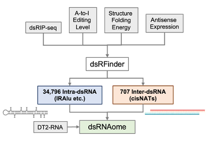

# dsRNAfinder



## Preparation 

### environment
```shell
# REDItools
git clone https://github.com/BioinfoUNIBA/REDItools 
mamba env create --name REDItools --file envs/mamba_env.yml
# RNAfold
mamba create -n py37 python=3.7 seaborn multiprocess bedtools=2.30.0 r-bedtoolsr bioconductor-iranges bioconductor-genomicranges r-argparse r-seqinr
# IntaRNA
mamba create -n IntaRNA -c conda-forge -c bioconda intarna bedtools=2.30.0 r-bedtoolsr bioconductor-iranges bioconductor-genomicranges r-argparse r-seqinr
```

### reference
```shell
# download reference from USCS
https://hgdownload.soe.ucsc.edu/goldenPath/hg38/bigZips/hg38.fa.gz
https://hgdownload.soe.ucsc.edu/goldenPath/hg38/bigZips/hg38.chrom.sizes   

gnFa="hg38.fa"
chrSize="chrom.size"
binSize=50
binBed="hg38.bins.50.bed"

bedtools makewindows -g ${chrSize} -w ${binSize} | awk '{print $1 "\t" $2 "\t" $3 "\t" "." "\t" "." "\t" "+"}'  > ${binBed}.tmp
#add strand
awk '{print $1 "\t" $2 "\t" $3 "\t" "." "\t" "." "\t" "-"}' ${binBed}.tmp >  ${binBed}.tmp2
cat ${binBed}.tmp ${binBed}.tmp2 | sort -k1,1 -k2,2n > ${binBed}
rm ${binBed}.tmp*
```

### prepare input
```shell
dsRIP_1_input.bam
dsRIP_1_IP.bam
dsRIP_2_input.bam
dsRIP_2_IP.bam
dsRIP_3_input.bam
dsRIP_3_IP.bam
```

## RNA editing calling
### REDItools
```shell
# REDItools
python2.7 reditools.py \
      -f ${input} \
      -r hg38.fa \
      -S -s 1 -ss 5 -mrl 20 -q 10 -bq 20 -C -T 2 -os 5 \
      -o {output}

# samtools mpileup
perl adapted_Query_Editing_Level.GRCh37.20161110.pl ${input} ${output}
```

### Editing sites filter
```shell
# REDItools
Rscript 1.REDItools_filter.R \
			--inTab ${input} \
			--outTab ${output} \
			--covQ30 3 \
			--MeanQ 0.0 \
			--AllSubs TRUE 
# samtools mpileup
Rscript 1.pileupAG_filter.R \
					--inTab ${input} \
					--outTab ${output} \
					--snp TRUE \
					--cov 3 --edited 1
```

## EER cluster
### get EER cluster
```shell
EERnum=1
mergeSize=1000
extSize=25
minLen=50
maxLen=3000
bash 2.getEERcluster.sh ${input} \
			${chrSize} ${gnFa} ${binSize} ${binBed} ${tmpDir} \
			${EERnum} ${mergeSize} ${extSize} ${minLen} ${maxLen}
```

### get consensus EER cluster
```shell
cov_num=2
cores=8
file="consensusEERcluster.bed"
bash 3.getEERconsensus.sh \
	EERcluster/ \
	EERconsensus/ \
	${file} ${cov_num} ${chrSize}
```

## Intra-dsRNA identification
### filter dsRIP coverage
```shell
# intra dsRNA
bed="consensusEERcluster.bed"
for sample in dsRIP-1-input dsRIP-1-IP dsRIP-2-input dsRIP-2-IP dsRIP-3-input dsRIP-3-IP
do 
		bedtools genomecov -ibam ${sample}.bam -strand + -bg -split \
                | LC_COLLATE=C sort -k1,1V -k2,2n -k3,3n \
                | grep chr | awk '{{print $1"\t"$2"\t"$3"\t"".""\t"$4"\t""+"}}' > ${sample}.pos 

    bedtools genomecov -ibam ${sample}.bam -strand - -bg -split \
                | LC_COLLATE=C sort -k1,1V -k2,2n -k3,3n \
                | grep chr | awk '{{print $1"\t"$2"\t"$3"\t"".""\t"$4"\t""-"}}' > ${sample}.neg 

    cat ${sample}.pos ${sample}.neg | sort -k1,1V -k2,2n -k3,3n > ${sample}.bedgraph 
		bedtools coverage -a ${bed} -b ${sample}.bedgraph -s > ${sample}.EERcluster.coverage
done

# filter intra- dsRNA
ratio=0.5
freq=0.5
cov=3
sampleid="sample_id.txt"
Rscript intra.EER_coverage_filter.R \
					--ratio $ratio \
					--freq $freq \
					--cov $cov \
					--bed consensusEERcluster.bed \
					--sampleid $sampleid \
					--input $indir \
					--output concensusEER_covfil.bed
sort -k1,1V -k2,2n -k3,3n consensusEER_covfil.bed > consensusEER_covfil_sort.bed        
```
### RNA fold
```shell
bedtools getfasta -nameOnly -s \
			 -fi ${gnFa} \
       -bed intra_RNAfold/consensusEER_covfil_sort.bed \
       > intra_RNAfold/consensusEER_covfil_sort.bed.fa

shuffle_times=50
seed=1234
cores=16
python intra.rnafold_dinushuffle_parallel.py \
        intra_RNAfold/consensusEER_covfil.bed.fa \
        ${shuffle_times} ${seed} \
        intra_RNAfold/consensusEER_covfil.bed.fa.csv \
        ${cores} 
rm $output/intra_RNAfold/${file}.fa_perm
```
### RNA fold filter
```shell
intraPairFrac=0.3
intraPairLen=15
intraMfeFdr=0.1
adjMFE= -0.3
inFdr="consensusEER_covfil_sort.bed.fa.csv"
inBed="consensusEER_covfil_sort.bed"
outBed="consensusEER_covfil_sort_rnafold.bed6"

Rscript intra.RNAfold_filterIntra.R \
				--inFdr $inFdr \
				--inBed $inBed \
				--intraPairFrac $intraPairFrac \
				--intraPairLen $intraPairLen \
				--intraMfeFdr $intraMfeFdr \
				--adjMFE $adjMFE \
				--outBed $outBed 
```

## Inter-dsRNA identification
### get sense-antisense pairs
```shell
file="consensusEERcluster.bed"
Rscript inter.getSenseAntisensePair.R \
	--inBed ${file} \
	--outDir inter_IntaRNA
```

### filter dsRIP coverage
```shell
# inter dsRNA
bed_pos="intersection_overlap.+.bed"
bed_neg="intersection_overlap.-.bed"
for sample in dsRIP-1-input dsRIP-1-IP dsRIP-2-input dsRIP-2-IP dsRIP-3-input dsRIP-3-IP
do
			bedtools coverage -a ${bed_pos} -b ${sample}.bedgraph -s > ${sample}.+ 
			bedtools coverage -a ${bed_neg} -b ${sample}.bedgraph -s > ${sample}.-
done
# filter intra- and inter- dsRNA
ratio=0.6
freq=0.3
cov=3
Rscript inter.EER_coverage_filter.R \
					--gnFa $gnFa \
					--input $indir \
					--sampleid $sampleid \
					--input $indir \
					--ratio $ratio \
					--freq $freq \
					--cov $cov \
					--output $outdir 

sort -k1,1V -k2,2n -k3,3n inter_IntaRNA/intersection_overlap_covfil.bed > inter_IntaRNA/intersection_overlap_covfil_sort.bed
```

### IntaRNA
```shell
cores=16
start=n1
end=n2
bash inter.IntaRNA.sh inter_IntaRNA $cores $n1 $n2
head -n 1 $output/result/IntaRNA_1.txt > $output/IntaRNA.txt
for i in `ls $output/result | grep -v MYPAIRMINE | grep -v log | cut -d "." -f 1 | cut -d "_" -f 2 | sort -n`
do
        echo $i
        tail -n +2 -q $output/result/IntaRNA_${i}.txt >> $output/IntaRNA.txt 
done
```

### IntaRNA filter
```shell
inFile="IntaRNA.txt"
interPairFrac <- 0.1
interPairLen <- 15
outFile="IntaRNA_filter.txt"
Rscript 10.IntaRNA_filterInter.R \
					--inFile $inFile \
					--interPairFrac $interPairFrac \
					--interPairLen $interPairLen \
					--outFile $outFile
```


